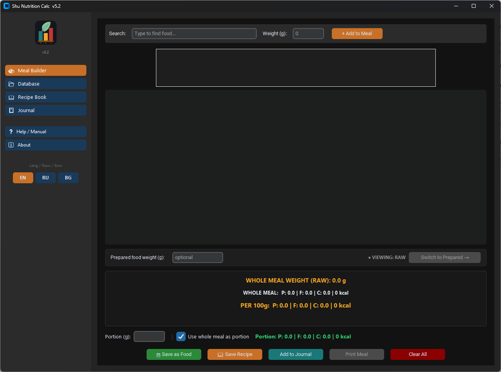
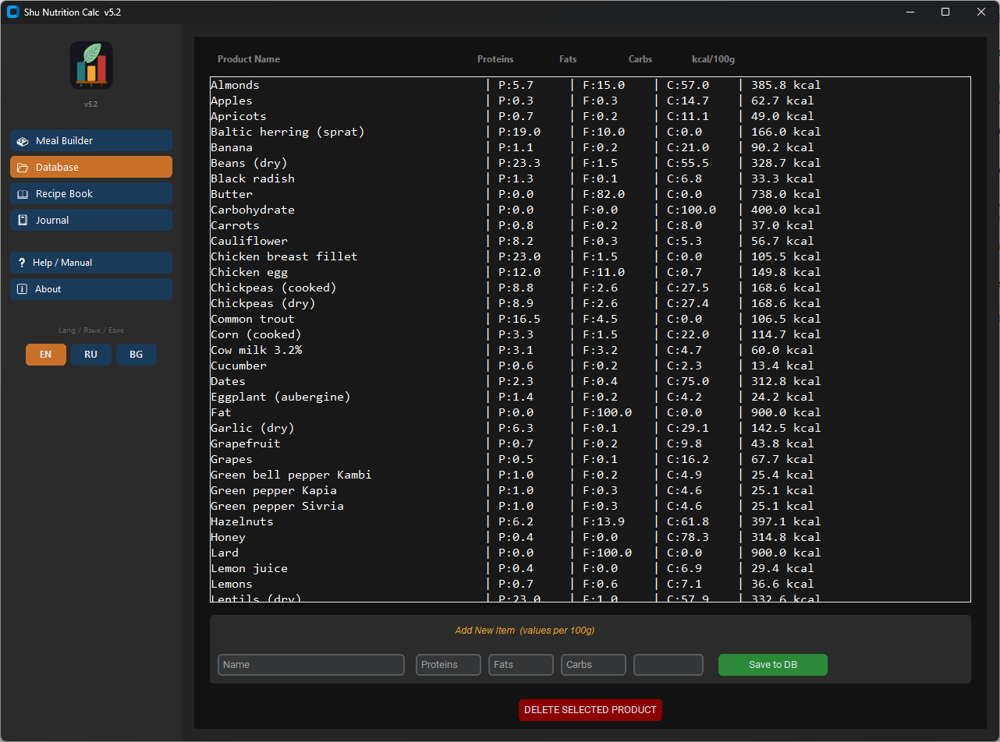
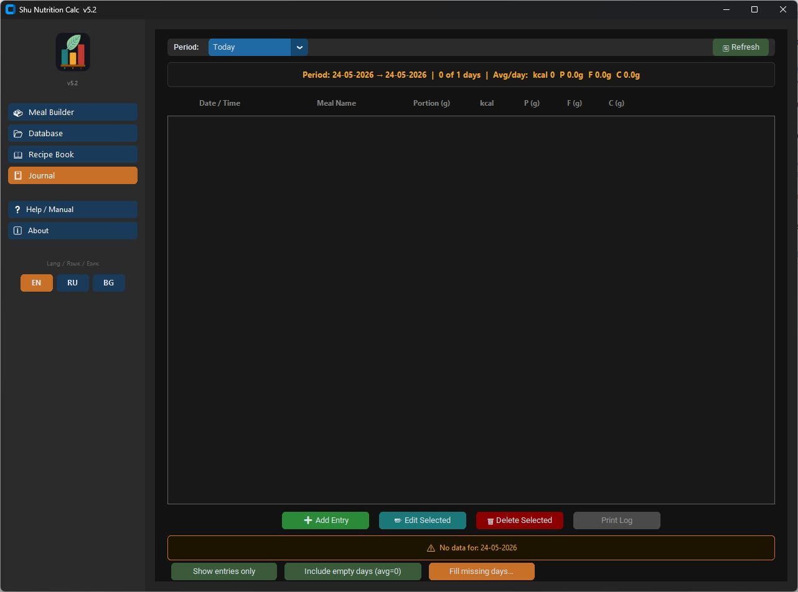
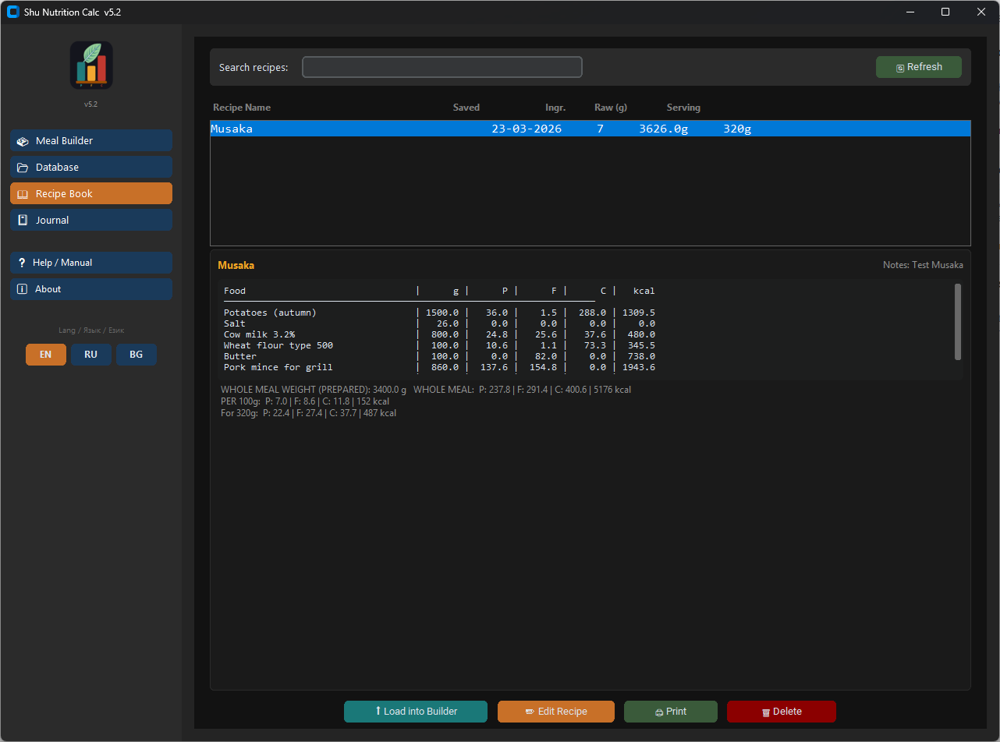
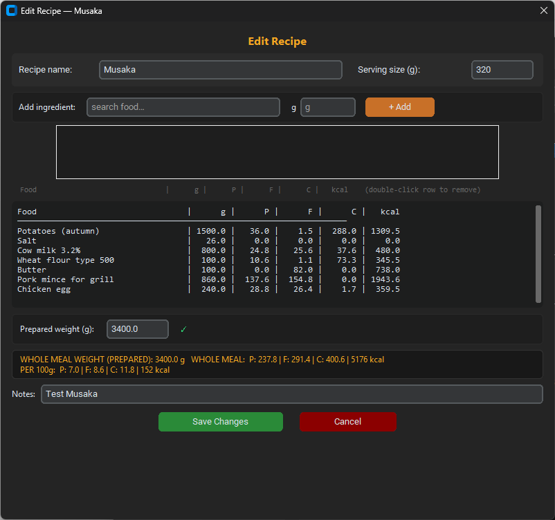

# Shu Nutrition Calc

[](https://www.gnu.org/licenses/gpl-3.0)
[](https://buymeacoffee.com/spirtosan)

A Windows desktop app for tracking daily nutrition and meal planning. Build meals from a food database, log them to a diary, save reusable recipes, and export HTML reports — all in Bulgarian, Russian, or English.

## Features

- **Meal Builder** — search your food database, add ingredients by weight, and see real-time protein / fat / carb / kcal totals for the whole meal, per 100 g, and per portion
- **Prepared food tracking** — enter the cooked weight of a meal to automatically recalculate macros after water loss
- **Food Database Manager** — add, edit, and delete foods; macros entered per 100 g, kcal calculated automatically
- **Recipe Book** — save any meal as a reusable recipe with a name, serving size, and notes; load recipes back into Meal Builder; print recipe cards
- **Backup & Restore** — back up all personal data files (food database, meal journal, recipes) to a zip file and restore from backup in one click — found in the About screen
- **Nutrition Journal** — log meals with date, time, portion size, and notes; browse any date range; view daily averages and totals
- **Fill Missing Days** — bulk-fill gaps in the journal with zero entries or manual values
- **HTML Print / Export** — generate printable reports for meals, recipes, and journal periods; light and dark themes
- **Multilingual UI** — full interface in English, Russian, and Bulgarian; switch language at runtime without restart
- **Starter food databases** — bundled databases for BG / RU / EN with common foods; choose at install time or start from scratch
- **No admin rights required** — installs per-user; no registry writes by the app itself
- **Portable data** — all data stored as plain JSON files next to the executable; easy to back up

## Screenshots

| Meal Builder | Database Manager |
|---|---|
|  |  |

| Journal | Recipe Book | Edit Recipe |
|---|---|---|
|  |  |  |

## Requirements

- Windows 10 or later (64-bit)
- No Python installation needed — the app is distributed as a self-contained `.exe`

## Installation

1. Go to the [Releases](../../releases) page and download `ShuNutritionCalc_v5.3_Setup.exe`
2. Run the installer — no administrator rights required
3. Choose your preferred starter food database (Bulgarian, Russian, English, or empty)
4. Optionally create a desktop or Start Menu shortcut
5. Launch the app

Data files (`food_db.json`, `meal_log.json`, `recipes.json`) are created automatically on first run in the installation folder.

## Building from Source

### Prerequisites

```
pip install customtkinter tkcalendar pyinstaller
```

### 1. Compile the Python app

Run from inside the `source/` folder:

```powershell
python -m PyInstaller --onefile --noconsole `
    --name ShuNutritionCalc `
    --icon=mylogo.ico `
    --add-data "img;img" `
    --collect-all customtkinter `
    --collect-all tkcalendar `
    shu_nutrition_calc.py
```

Or as a single line (works in PowerShell and cmd.exe):

```
python -m PyInstaller --onefile --noconsole --name ShuNutritionCalc --icon=mylogo.ico --add-data "img;img" --collect-all customtkinter --collect-all tkcalendar shu_nutrition_calc.py
```

Output: `dist\ShuNutritionCalc.exe`

### 2. Build the Windows installer (optional)

Requires [Inno Setup 6](https://jrsoftware.org/isinfo.php).

1. Copy `source\dist\ShuNutritionCalc.exe` → `ShuNutritionCalc_Installer\assets\ShuNutritionCalc.exe`
2. Open `ShuNutritionCalc_Installer\ShuNutritionCalc.iss` in Inno Setup
3. Press **Ctrl+F9** to compile
4. Output: `ShuNutritionCalc_Installer\Output\ShuNutritionCalc_v5.3_Setup.exe`

See `ShuNutritionCalc_Installer\README_installer.txt` for the full step-by-step build guide.

## Source Layout

```
source/
├── shu_nutrition_calc.py   — entry point, main window, sidebar, language switcher
├── config.py               — constants, file paths, defaults
├── models.py               — data I/O, all macro calculations
├── lang.py                 — translation engine, t() function
├── ui_meal_builder.py      — Meal Builder tab
├── ui_database.py          — Database Manager tab
├── ui_log.py               — Journal tab and dialogs
├── ui_recipes.py           — Recipe Book tab
├── ui_print.py             — HTML report generation
└── img/                    — app icons (PNG + SVG + ICO)

ShuNutritionCalc_Installer/
├── ShuNutritionCalc.iss    — Inno Setup installer script
├── README_installer.txt    — build instructions
└── assets/                 — files distributed with the installer
    ├── lang/               — UI translation strings (EN / RU / BG)
    ├── help/               — HTML user manuals (EN / RU / BG)
    └── db/                 — starter food databases
```

## License

This project is licensed under the **GNU General Public License v3.0** — see the [LICENSE](LICENSE) file for details.

---

If this app saves you time, consider buying me a coffee:
[](https://buymeacoffee.com/spirtosan)
